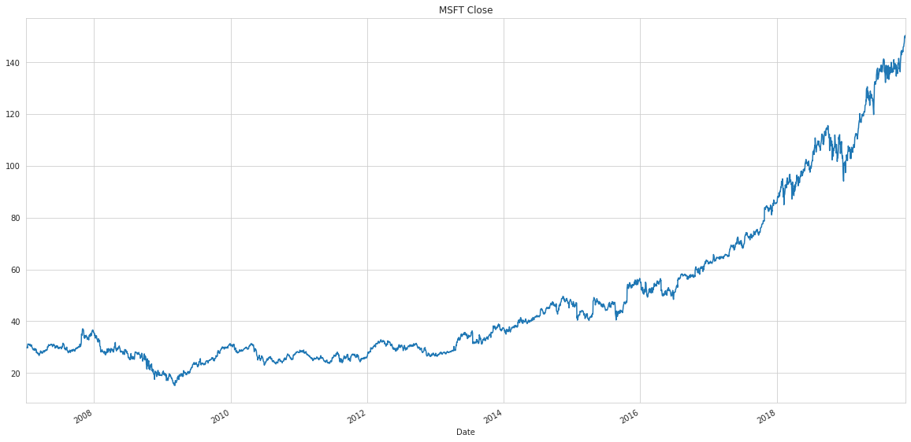

# SimFin - Simple financial data for Python

SimFin makes it easy to obtain and use financial and stock-market data in
Python. It automatically downloads share-prices and fundamental data from
the [SimFin](https://www.simfin.com/) server, saves the data to disk for
future use, and loads the data into Pandas DataFrames.

## Installation

    pip install simfin
    
More detailed installation instructions can be found [below](https://github.com/SimFin/simfin#installation-detailed-instructions).

## API-Key

To download data from SimFin you need an API-key, you can get one for free by registering on [simfin.com](https://simfin.com/login). Once you registered, you can find your API-key [here](https://simfin.com/data/api).
The free datasets contain less data than the paid [SimFin+](https://simfin.com/simfin-plus) datasets and some datasets are only available to [SimFin+](https://simfin.com/simfin-plus) users.
Visit [SimFin](https://simfin.com/data/bulk) for a comparison of the free and paid data versions.

## Example

Once the simfin package has been installed and you got your API-key, the following Python
program will automatically download all Income Statements for US companies,
and print the Revenue and Net Income for Microsoft.

    import simfin as sf
    from simfin.names import *

    # Set your API-key for downloading data.
    # Replace YOUR_API_KEY with your actual API-key.
    sf.set_api_key('YOUR_API_KEY')

    # Set the local directory where data-files are stored.
    # The dir will be created if it does not already exist.
    sf.set_data_dir('~/simfin_data/')

    # Load the annual Income Statements for all companies in the US.
    # The data is automatically downloaded if you don't have it already.
    df = sf.load_income(variant='annual', market='us')

    # Print all Revenue and Net Income for Microsoft (ticker MSFT).
    print(df.loc['MSFT', [REVENUE, NET_INCOME]])

This produces the following output:

                      Revenue   Net Income
    Report Date
    2008-06-30   6.042000e+10  17681000000
    2009-06-30   5.843700e+10  14569000000
    2010-06-30   6.248400e+10  18760000000
    2011-06-30   6.994300e+10  23150000000
    2012-06-30   7.372300e+10  16978000000
    2013-06-30   7.784900e+10  21863000000
    2014-06-30   8.683300e+10  22074000000
    2015-06-30   9.358000e+10  12193000000
    2016-06-30   9.115400e+10  20539000000
    2017-06-30   9.657100e+10  25489000000
    2018-06-30   1.103600e+11  16571000000
    2019-06-30   1.258430e+11  39240000000

We can also load the daily share-prices and plot the closing share-price for
Microsoft (ticker MSFT):

    # Load daily share-prices for all companies in USA.
    # The data is automatically downloaded if you don't have it already.
    df_prices = sf.load_shareprices(market='us', variant='daily')
    
    # Plot the closing share-prices for ticker MSFT.
    df_prices.loc['MSFT', CLOSE].plot(grid=True, figsize=(20,10), title='MSFT Close')

This produces the following image:

## Documentation

-   [Tutorials](https://www.github.com/simfin/simfin-tutorials/) with
    detailed examples.
-   [Datasets](https://simfin.com/data/bulk) that are available.
-   [Docs](https://simfin.readthedocs.io/en/latest/) for the
    Python API.

## Installation (Detailed Instructions)

The best way to install simfin and use it in your own project, is to
use a virtual environment. You write the following in a Linux terminal:

    virtualenv simfin-env

You can also use Anaconda instead of a virtualenv:

    conda create --name simfin-env python=3

Then you can install the simfin package inside that virtual environment:

    source activate simfin-env
    pip install simfin

If the last command fails, or if you want to install the latest development
version from this GitHub repository, then you can run the following instead:

    pip install git+https://github.com/simfin/simfin.git

Now try and put the above example in a file called `test.py` and run:

    python test.py

When you are done working on the project you can deactivate the virtualenv:

    source deactivate

## Development

If you want to modify your own version of the simfin package, then you
should clone the GitHub repository to your local disk, using this command
in a terminal:

    git clone https://github.com/simfin/simfin.git

This will create a directory named simfin on your disk. Then you need to
create a new virtual environment, where you install your local copy of
the simfin package using these commands:

    conda create --name simfin-dev python=3
    source activate simfin-dev
    cd simfin
    pip install --editable .

You should now be able to edit the files inside the simfin directory and
use them whenever you have a Python module that imports the simfin package,
while you have the virtual environment `simfin-dev` active.

## Testing

Two kinds of tests are provided with the simfin package:

### Unit Tests

Unit-tests ensure the various functions of the simfin package can
run without raising exceptions. The unit-tests generally do not test
whether the data is valid. These tests are mainly used by developers
when they make changes to the simfin package.

The unit-tests are run with the following commands from the root directory
of the simfin package:

    source activate simfin-env
    pytest

### Data Tests

Data-tests ensure the bulk-data downloaded from the SimFin servers
is valid. These tests are mainly used by SimFin's database admin to
ensure the data is always valid, but the end-user may also run these
tests to ensure the downloaded data is valid.

First you need to install [nbval](https://pypi.org/project/nbval/),
which enables support for Jupyter Notebooks in the pytest framework.
This is not automatically installed with the simfin package, so as
to keep the number of dependencies minimal for normal users of simfin.
To install nbval run the following commands:

    source activate simfin-env
    pip install nbval

Then you can run the following commands from the root directory of the
simfin package to execute both the unit-tests and data-tests:

    pytest --nbval-lax

The following command only runs the data-tests:

    pytest --nbval-lax -v tests/test_bulk_data.ipynb

### More Tests

The [tutorials](https://www.github.com/simfin/simfin-tutorials/)
provide more realistic use-cases of the simfin package, and they can
also be run and tested automatically using `pytest`. See the tutorials'
README for details.

## Credits

The database is created by [SimFin](https://www.simfin.com/).
The Python API and download system was originally designed and
implemented by [Hvass Labs](https://www.github.com/Hvass-Labs/).
Further development of the Python API by SimFin and the community.

## License (MIT)

This is published under the
[MIT License](https://github.com/simfin/simfin/blob/master/LICENSE.txt)
which allows very broad use for both academic and commercial purposes.

You are very welcome to modify and use this source-code in your own project.
Please keep a link to the [original repository](https://github.com/simfin/simfin).
